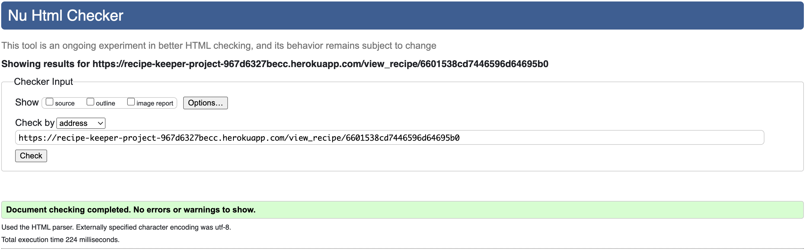
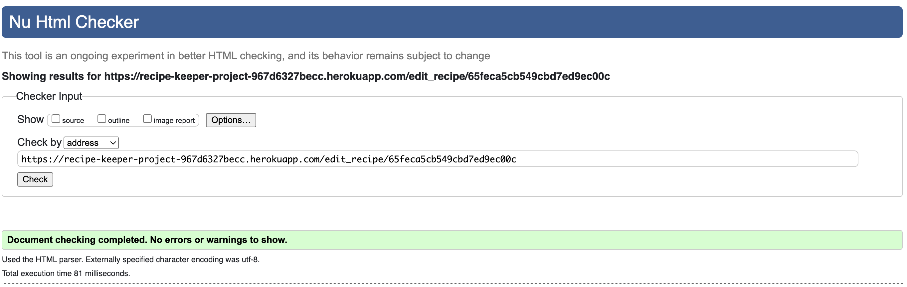
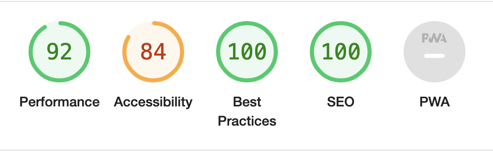

# Recipe Keeper


Recipe Keeper is a user-friendly website designed to help users discover and organize their favourite recipes. Whether you're a seasoned chef or just starting out in the kitchen, Recipe Keeper offers a platform where you can upload your own recipes, explore recipes shared by others, and keep track of your culinary creations.

[Access the live site here.](https://recipe-keeper-project-967d6327becc.herokuapp.com/)

## User Experience (UX)

Recipe Keeper has been developed as a simple and intuitive storage application for users to create and edit their recipes whilst discovering new ones. Recipe Keeper was designed for my Milestone Project 3 with [Code Institute](https://codeinstitute.net/) aimed specifically at back end development with databases using Python and Flask. Although there was no specific client in mind for the project, I had several user goals I wanted to achieve.

### User Goals

- Display your recipe: Create and save your favourite recipes and have them greet all users on the home page.
- Recipe Management: Add, Delete, Edit and View your personal recipes within your profile.
- Personalized Experience: Create your account with unique user authentication.

### User Stories

1. I want to be able to create a profile to store my recipes.
2. I want to be able to view personal recipes and recipes created by others.
3. I want to be able to create, edit and delete recipes should I need to.

### Design

#### Colour Scheme

The main colours used throughout the site were chosen from [Coolors](https://coolors.co/) using the generator until I come across colors I liked.

<details><summary>Recipe Keeper Colour Scheme</summary>

</details>

#### Typography

Roboto is the main font used throughout the website which provides a highly-readable text at all sizes.

#### Imagery

Only one image is used throughout the website and that is the default recipe card image, should a user not provide the optional URL to display a recipe image. The image was found on [Freepik](https://www.freepik.com/free-photo/delicious-goulash-ready-dinner_25178936.htm).

<details><summary>Default Recipe Card Image URL</summary>

</details>

## Features

- Responsive on all devices
- Intutive top navbar on large device screens and a sidenav on smaller screens.
- Ability to register an account, loging and logout if you're an existing user.
- Home (Recipes) page where recipes created by all registered users are displayed as cards, that can then be selected, to take users to the full recipe.
- A view recipe page, where selected recipes are displayed with all required ingredients and cooking method.
- User profile's, where user's can add, edit, view or delete their personal recipes.
- Forms to register, login, add and edit recipes.
- Flash messages when users have successfully registered, logged in or out, created, edited or deleted a recipe.
- Defensive programming when logining and a modal to confirm a deletion action, to prevent unintentional data loss.

### Future Features

Features I would like to include in the future are:

- Like feature on recipes found on the home page.
- Comment feature on recipes found on the home page.

## Technologies Used

### Languages

- HTML
- CSS
- Jquery
- Javascript
- Python

### Frameworks 

- [Flask](https://pypi.org/project/Flask/) - A micro web framework written in Python.
- [Materialize v1.0.0](https://materializecss.com) - A responsive front-end CSS library based on Google's Material Design.

### Libraries

- [Font Awesome:](https://fontawesome.com/) - For the icons on the website.
- [Jinja](https://jinja.palletsprojects.com/en/3.1.x/) - A fast, expressive, extensible templating engine.

### Programs

1. [Heroku](https://www.heroku.com) - For website deployment.
1. [MongoDB](https://www.mongodb.com) - The database used for storing information for the site.
1. [Github:](https://github.com/) - To save and store the files for the website.
1. [Red Ketchup:](https://redketchup.io/image-resizer) - To rezie images.
1. [Cloud Convert:](https://cloudconvert.com/jpeg-to-webp) - To convert images from jpeg to webp.
1. [Coolers:](https://coolors.co/223843-eff1f3-dbd3d8-d8b4a0-d77a61) - Used for project color palette 

## Testing

Testing was conducted throughout the development process to ensure site functionality.

### HTML Testing

The [W3C Markup Validator](https://validator.w3.org/) service was used to validate the site's pages to ensure there were no syntax errors.

<details><summary>Index HTML Validation</summary>

</details>

<details><summary>Register HTML Validation</summary>

</details>

<details><summary>Login HTML Validation</summary>

</details>

<details><summary>Profile HTML Validation</summary>

</details>

<details><summary>Add Recipe HTML Validation</summary>

</details>

<details><summary>View HTML Validation</summary>

</details>


<details><summary>Edit Recipe HTML Validation</summary>

</details>

### CSS Testing

The [W3 CSS Validator](https://jigsaw.w3.org/css-validator/) was used to validate custom css styling.

<details><summary>CSS Validation</summary>

</details>

### JavaScript Testing

[JS HINT](https://jshint.com/) was used to test the jquery code copied from Materialize.

<details><summary>JavaScript Validation</summary>

</details>

### Python Testing

[CI Pythong Linter](https://pep8ci.herokuapp.com/#) has been used to validate my python code and esnured it's pep8 compliant.

<details><summary>Python Validation</summary>

</details>

### Lighthouse

The Chrome Developer Tools lighthouse feature was employed to assess performance, adherence to best practices, accessibility, and Search Engine Optimisation (SEO). Both desktop and mobile tests were conducted for each page.

<details><summary>Index</summary>


</details>

| | Performance | Accessibility | Best Practice | SEO |
| :---: | :---: | :---: | :---: | :---: |
| Desktop | 95 | 84 | 100 | 100 |
| Mobile | 69 | 84 | 100 | 100 |

<details><summary>Register</summary>


</details>

| | Performance | Accessibility | Best Practice | SEO |
| :---: | :---: | :---: | :---: | :---: |
| Desktop | 99 | 78 | 100 | 100 |
| Mobile | 90 | 78 | 96 | 100 |

<details><summary>Login</summary>



</details>

| | Performance | Accessibility | Best Practice | SEO |
| :---: | :---: | :---: | :---: | :---: |
| Desktop | 100 | 78 | 100 | 100 |
| Mobile | 92 | 78 | 96 | 100 |

<details><summary>Profile</summary>


</details>

| | Performance | Accessibility | Best Practice | SEO |
| :---: | :---: | :---: | :---: | :---: |
| Desktop | 100 | 83 | 96 | 100 |
| Mobile | 92 | 83 | 96 | 100 |

<details><summary>Add Recipe</summary>


</details>

| | Performance | Accessibility | Best Practice | SEO |
| :---: | :---: | :---: | :---: | :---: |
| Desktop | 99 | 76 | 100 | 100 |
| Mobile | 82 | 76 | 100 | 100 |

<details><summary>View Recipe</summary>


</details>

| | Performance | Accessibility | Best Practice | SEO |
| :---: | :---: | :---: | :---: | :---: |
| Desktop | 97 | 92 | 100 | 100 |
| Mobile | 70 | 92 | 100 | 100 |

<details><summary>Edit Recipe</summary>


</details>

| | Performance | Accessibility | Best Practice | SEO |
| :---: | :---: | :---: | :---: | :---: |
| Desktop | 99 | 76 | 100 | 100 |
| Mobile | 86 | 76 | 100 | 100 |

## Deployment

### Live

The project was deployed to [Heroku](https://dashboard.heroku.com/). [Access the live site here.](https://recipe-keeper-project-967d6327becc.herokuapp.com/)

### Heroku

To deploy your app on [Heroku](https://www.heroku.com/platform), these are the steps to follow: 

1. Create a requirements.txt and a Procfile, within your project.
2. The requirements.txt file contains all the applications and dependencies that are required to run the app. To create the requirements.txt file run the following command in the terminal:

    ```bash
    pip3 freeze --local > requirements.txt
    ```
3. The Procfile tells Heroku which files run the app and how to run it. To create the Procfile run the following command in the terminal:

    ```bash
    echo web: python run.py > Procfile
    ```
    NOTE: This is assuming the file used to launch your app is called run.py, otherwise replace with the correct file name. The Procfile uses a capital P and doesn't have a file extension on the end.
4. If the Procfile has been created correctly it will display the Heroku logo next to it. Ensure there are no blank lines at the end of the file, as this can cause issues when deployiong.
5. Make sure to save these files, then add, commit and push to GitHub.
6. Sign up for an account with Heroku.
7. Click New button and select Create New App.
8. Choose a name for your app (This must be unique).
9. Select a region (EU or USA) and click Create App.
10. Choose your connection method, I used automatic deployment from the GitHub repo. 
11. Make sure your GitHub profile is displayed and search for the repository. You may need to connect to your GitHub account if not completed at registration.
12. Once the repo is found, click connect.
13. Navigate to the Settings tab and click on Reveal Config Vars
14. Each variable from the env.py file must be replicated here in key-value pairs and without quotes. (See table below).

| Key | Value |
| --- | --- |
| `DATABASE_URL` | user's own value |
| `IP` | 0.0.0.0 |
| `MONGO_DBNAME` | user's own value |
| `MONGO_URI` | user's own value |
| `PORT` | 5000 |
| `SECRET_KEY` | user's own value |


15. Once all config vars are added, you can now navigate back to the deploy tab and click Enable Automatic Deploys, select the branch to deploy and click Deploy.
16. Once complete, you can click Open App to view the live site.
- NOTE: The live site will now update any time changes are pushed to the connected GitHub repository.

### MongoDB Non-Relational Database

This project uses [MongoDb](https://www.mongodb.com/atlas), non-relation database.

To connect your repositry to your database, follow these steps:

1. Sign up for a MongoDB account.
2. Select tier (plan), cloud provider, and locality for deployment.
3. Create a cluster.
4. Set up a new database user in Database Access, choosing a username and password for authentication, only using letters and numbers to avoid connection issues.
5. Select built-in role of "read and write to any database".
6. Add IP address, selecting whether it is local or allow access from anywhere.
7. Create a database and collections: This database name MUST be added to the env.py file as the value for "MONGO_DBNAME".
8. Connect to the cluster.
9. Copy the connection string provided and add it to the env.py file as the value for "MONGO_URI".
10. Replace the <password> placeholder string with the password your created in step 4.
11. Add the database name created in step to the connection string between the '/' and '?'.


### Fork Repository

By forking the GitHub Repository we make a copy of the original repository on our GitHub account to view and/or make changes without affecting the original repository by using the following steps:

1. Log in to GitHub and locate the [GitHub Repository](https://github.com/donovanainsley/recipe-keeper)
2. At the top of the Repository (not top of page) just below the "Settings" Button on the menu, locate the "Fork" Button.
3. You should now have a copy of the original repository in your GitHub account.

### Clone Repository

To clone the recipe keeper repository:

1. Log in to GitHub and locate the [GitHub Repository](https://github.com/donovanainsley/recipe-keeper).
2. Click the green "Code" button, select whether you would like to clone with HTTPS, SSH or GitHub CLI and copy the link shown.
3. Open in the terminal in your code editor.
4. Change the current working directory to the location where you want the cloned directory to be made.
5. Type git clone, and then paste the URL you copied in Step 2.
6. Press enter. Your local clone has now been created.

## Credits

### Code

1. [Materialize CSS 1.0.0](https://materializecss.com/about.html)
   - Materialize was used to help to create the framwork and responsiveness of the website

1. [Code Institute](https://codeinstitute.net/)
   - Using The Code Institues Task Manager Application walkthrough which helped me with CRUD functionailty.

### Content

Content for the website was written by the developer, [donovanainsley](https://github.com/donovanainsley)

### Media 

- Back-up URL image for recipe cards was sourced from [Freepik](https://www.freepik.com/).